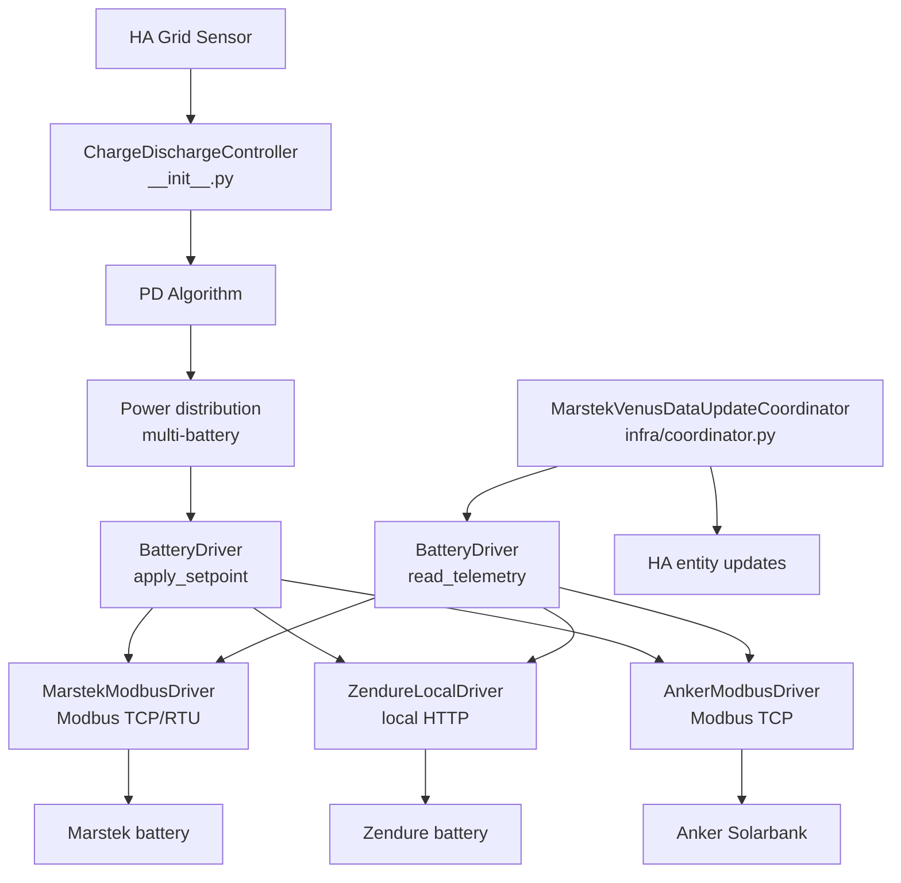

# Architecture

## Main components



The control loop and the coordinator never talk to the hardware directly: every
read and write goes through a brand-agnostic **`BatteryDriver`** (see [Hardware
drivers](#hardware-drivers) below). This is what makes the integration
multi-brand — adding a battery brand is writing a new driver, not editing the
control logic.

## Modules

The integration root keeps only the Home Assistant platform files
(`sensor.py`, `number.py`, …) and the controller. Everything else lives in
subpackages by responsibility.

| File | Main class | Responsibility |
|---|---|---|
| `__init__.py` | `ChargeDischargeController` | Main control loop (event-driven on the grid sensor + 2 s watchdog), PD algorithm, multi-battery distribution |
| `config_flow.py` | — | Multi-step configuration wizard in HA UI (brand selection, batteries, features) |
| **`drivers/`** | `BatteryDriver` | Brand-agnostic hardware abstraction — see below |
| `drivers/base.py` | `BatteryDriver`, `DriverCapabilities` | The driver contract and the static-traits dataclass |
| `drivers/marstek.py` | `MarstekModbusDriver` | Marstek Venus (v2/v3/vA/vD) over Modbus TCP / RTU |
| `drivers/zendure.py` | `ZendureLocalDriver` | Zendure SolarFlow over local HTTP |
| `drivers/anker.py` | `AnkerModbusDriver` | Anker SOLIX Solarbank Max AC / 4 E5000 Pro over Modbus TCP (FC03/FC04 reads) |
| `infra/coordinator.py` | `MarstekVenusDataUpdateCoordinator` | Periodic telemetry polling (via the driver), entity updates |
| `infra/modbus_client.py` | `MarstekModbusClient` | Async Modbus TCP/RTU transport via pymodbus, retries with backoff |
| `infra/anker_modbus_client.py` | `AnkerModbusClient` | Async Modbus TCP for Anker (FC03/FC04 reads, FC06/FC16 writes) |
| `infra/external_loads.py` | — | Excluded-device load adjustment and solar-surplus crediting |
| `infra/alarm_notifier.py` | `AlarmNotifier` | Alarm/fault bit-delta detection and HA persistent notification formatting |
| `infra/entity_naming.py` | — | Translation-key based entity IDs and registry migrations |
| `const/` | — | All Modbus register and entity definitions (split per battery version) |
| `pricing/engine.py` | — | Predictive charging: dynamic pricing, time slot, real-time price, SOC floor |
| `pricing/chronological.py` | — | Pure 15-minute energy simulation, cumulative deadlines and price-slot allocation; no Home Assistant or device I/O |
| `control/power_distribution.py` | — | Splits the system setpoint across active batteries |
| `control/charge_delay.py` | — | Solar charge delay |
| `control/max_soc_charge.py` | — | 100 % voltage taper / top-of-charge protection |
| `control/weekly_full_charge.py` | `WeeklyFullChargeManager` | Weekly full charge state, persistence and register-write orchestration |
| `tracking/consumption_tracker.py` | `ConsumptionTracker` | Consumption history, daily energy accumulators, solar-timing detection, recorder backfill, daily capture |
| `tracking/balance_monitor.py` | `CellBalanceMonitor` | Post-full-charge cell voltage spread measurement and health history |
| `tracking/non_responsive_tracker.py` | `NonResponsiveTracker` | Non-responsive battery detection and 5-minute exclusion windows |
| `tracking/hourly_balance.py` | — | Hourly net-balance (Spain RD 244/2019) accounting |
| `sensors/aggregate_sensors.py` | — | System aggregate sensors (sum across all batteries) |
| `sensors/calculated_sensors.py` | — | Derived sensors (cycle count, efficiency, synthetic energy, estimates) |

## Hardware drivers

A **driver** owns all brand-specific hardware I/O — transport, connection
lifecycle, telemetry decoding and control commands — behind a single interface,
[`drivers/base.py`](https://github.com/ffunes/omnibattery/blob/main/custom_components/omnibattery/drivers/base.py)`::BatteryDriver`.
The coordinator and the control loop talk only to that interface, so they never
branch on battery brand or firmware version.

The contract is deliberately **semantic, not register-shaped**. It exposes two
operations — "give me a telemetry snapshot" and "deliver this net power" — so a
register/Modbus battery (Marstek) and a property/HTTP battery (Zendure) both fit
behind it without register addresses or HTTP paths leaking into the control
layer.

### What a driver provides

| Surface | Method / property | Purpose |
|---|---|---|
| Identity | `capabilities`, `model_label` | Static hardware traits (see below) and a display label |
| Connection | `connect()`, `close()`, `connected` | Transport lifecycle (owns the v3 single TCP slot, etc.) |
| Read | `read_telemetry(keys)`, `read_groups` | Latest telemetry as a flat `{logical_key: value}` dict; `read_groups` lets the coordinator schedule polling per register block |
| Write | `apply_setpoint(net_power_w, …)` | Command a single signed net power (+charge / −discharge); the driver translates to its own wire format |
| Write | `write_control(key, value)` | Generic entity-write path for user-facing number/select/switch entities |

`apply_setpoint` returns a `SetpointResult` carrying the applied power, whether
the write was confirmed by a readback, the measured delivered power, and a
brand-native state echo the coordinator merges into `coordinator.data`.

Individual manual ownership is coordinated above the driver. On handoff the
controller verifies an idle (`0 W`) setpoint, then excludes the battery from
automatic assignments. Drivers without force-mode/setpoint registers (for
example Zendure and Anker) receive their persisted manual charge/discharge
setpoint through `apply_setpoint` on each control cycle; an idle (`None`) manual
selection is deliberately not reasserted, so it does not fight the device's
own app mode.

### Capabilities replace version checks

Each driver reports a frozen `DriverCapabilities` once; callers consult it instead
of hard-coding `if battery_version in (...)`. The control and entity layers read
these from `coordinator.capabilities`:

| Capability | Meaning |
|---|---|
| `hardware_soc_cutoff` | Hardware enforces min/max SOC itself (v2); otherwise the control layer does it in software |
| `has_force_mode` | Hardware has a distinct force/charge/discharge mode command |
| `push_telemetry` | Telemetry arrives by push rather than poll |
| `max_charge_power_w` / `max_discharge_power_w` | Power envelope the hardware accepts |
| `has_mppt_pv` | DC-coupled PV / MPPT inputs present (Venus A/D) |
| `has_alarm_registers` | Exposes alarm/fault status (Marstek v2 only) |
| `has_rs485_control` | External RS485/Modbus control mode can be toggled |
| `has_energy_counters` | Reports cumulative energy + nominal capacity; when false the integration synthesises energy from power and takes capacity from a user entity (Zendure) |
| `setpoint_confirm_reliable` | A readback reliably reflects the just-written command on the confirmation cycle |
| `actuator_latency_s` | Physical response timescale used to guard charge/discharge direction changes |
| `readback_latency_s` | Time before post-command telemetry is settled enough for a hot-path readback; defaults to actuator latency |

The coordinator selects the driver from the configured brand
([`infra/coordinator.py`](https://github.com/ffunes/omnibattery/blob/main/custom_components/omnibattery/infra/coordinator.py)):
`zendure` → `ZendureLocalDriver`, `anker` → `AnkerModbusDriver`, `esphome` → `EsphomeEntityDriver`, otherwise `MarstekModbusDriver`. The driver
also owns its version's register/entity definition lists, which the platform
setups read back instead of branching on the version string.

## Data flow

```
Grid sensor → Controller (PD) → Power distribution → driver.apply_setpoint → Batteries
                    ↑
Coordinator → driver.read_telemetry → Entity updates
```

## Polling intervals

| Interval | Period | Registers |
|---|---|---|
| `high` | 2 s | Power, SOC |
| `medium` | 5 s | Voltage, current, temperature |
| `low` | 30 s | Accumulated energy, alarms |
| `very_low` | 600 s | Device info, firmware |

## Consumption profile

`tracking/consumption_profile.py` owns the independent
`omnibattery.<entry_id>.consumption_profile` Store. It captures adjusted home
power continuously into raw local-date/96-interval energy and coverage arrays,
then builds a weighted forecast only at query time. Recorder backfill is
background work and never blocks setup or battery control. The tracker rejects
invalid samples, isolates corrupt stored days, handles local DST boundaries and
invalidates the raw profile when its source/configuration fingerprint changes.

Control consumers use one contract: mature profile data for the requested range,
otherwise an explicit legacy fallback. Neither capture nor runtime household
forecasts mask predictive charging windows; those windows schedule battery grid
charging rather than household operation. This keeps the same learned signal usable by daily predictive
charging, Solar Charge Delay and Dynamic Pricing without coupling their runtime
decisions to one another.

## Solar temporal profile

`tracking/solar_profile.py` stores direct-PV energy, coverage and compact quality
flags in `omnibattery.<entry_id>.solar_profile`. It learns a normalized shape on
solar-window progress, with bounded 42-day retention and an isolated
fingerprint/generation. It never learns from grid balance, export, weather
forecast or the rounded public daily-energy sensor.

`pricing/solar_timeline.py` validates dated provider periods, maps learned
progress bins, builds the sinusoidal fallback and applies the remaining budget
exactly once. `pricing/chronological.py` continues to receive only finished
`EnergyInterval` values and remains free of Home Assistant dependencies.
